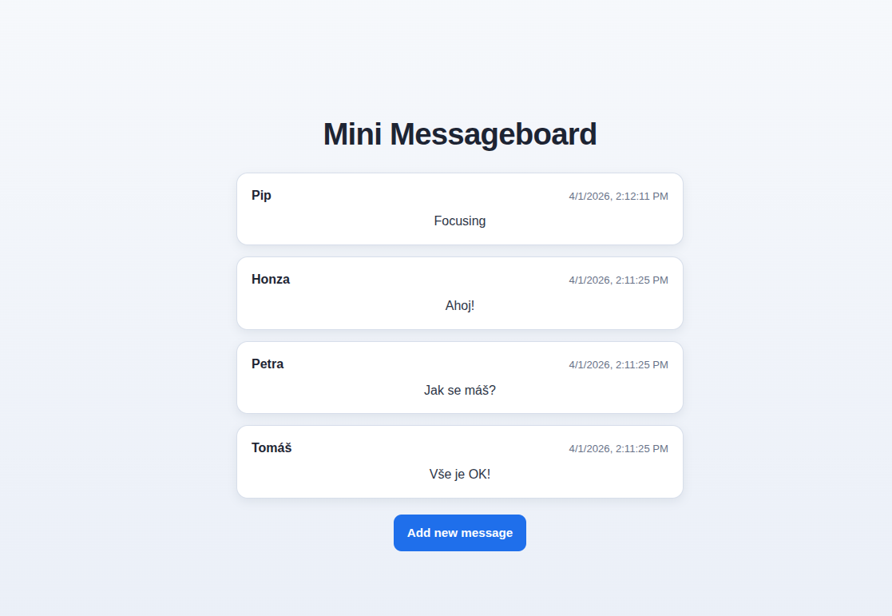

# Mini Dashboard

A simple messageboard application built with Node.js, Express, and PostgreSQL.



## Features

- View all messages from the messageboard
- Add new messages with username and text
- Messages are stored persistently in PostgreSQL database
- Messages are displayed in reverse chronological order (newest first)
- Responsive web interface with EJS templating

## Tech Stack

- **Backend**: Node.js, Express.js
- **Database**: PostgreSQL
- **Templating**: EJS
- **Environment**: dotenv for configuration

## Project Structure

```
├── app.js                    # Main application entry point
├── package.json              # Project dependencies
├── .env                      # Environment variables (create this)
├── .env.example              # Environment variables template
├── controllers/
│   └── usersController.js    # Route handlers for messages
├── db/
│   ├── pool.js               # PostgreSQL connection pool
│   ├── queries.js            # Database queries
│   └── populatedb.js         # Database initialization script
├── public/
│   └── styles.css            # Application styling
├── routes/
│   ├── indexRouter.js        # Home page route
│   └── newRouter.js          # New message routes
└── views/
    ├── components/           # Reusable EJS components
    │   ├── form.ejs          # Message form
    │   ├── head.ejs          # HTML head
    │   └── messages.ejs      # Messages display
    └── layouts/              # Page layouts
        ├── index.ejs         # Home page
        └── new.ejs           # New message page
```

## Installation

1. **Clone or navigate to the project directory**

2. **Install dependencies**

    ```bash
    npm install
    ```

3. **Create `.env` file** in the project root:

    ```
    PORT = 3001
    DB_HOST = localhost
    DB_NAME = mini_dashboard
    DB_USER = your_postgres_user
    DB_PASSWORD = your_postgres_password
    DB_PORT = 5432
    ```

4. **Create PostgreSQL database**

    ```bash
    createdb mini_dashboard
    ```

5. **Initialize database with sample data**
    ```bash
    node db/populatedb.js
    ```

## Running the Application

Start the development server:

```bash
npm start
```

Or run directly:

```bash
node app.js
```

The application will be available at `http://localhost:3001`

## Usage

1. **View Messages**: Visit the home page to see all messages
2. **Add Message**: Click "New Message" link to create a new message
3. **Submit**: Fill in your name and message, then submit

All messages are automatically saved to the PostgreSQL database.

## Database Schema

The `messages` table contains:

- `id` (INTEGER PRIMARY KEY IDENTITY) - Unique identifier
- `username` (VARCHAR(255)) - Author's name
- `message` (TEXT) - Message content
- `created_at` (TIMESTAMP) - Creation timestamp

## Environment Variables

- `PORT` - Server port (default: 3001)
- `DB_HOST` - PostgreSQL host
- `DB_NAME` - Database name
- `DB_USER` - PostgreSQL username
- `DB_PASSWORD` - PostgreSQL password
- `DB_PORT` - PostgreSQL port (default: 5432)

## Dependencies

See `package.json` for all dependencies:

- express - Web framework
- pg - PostgreSQL client
- ejs - Templating engine
- dotenv - Environment variable management
